# AVD Live Dashboard

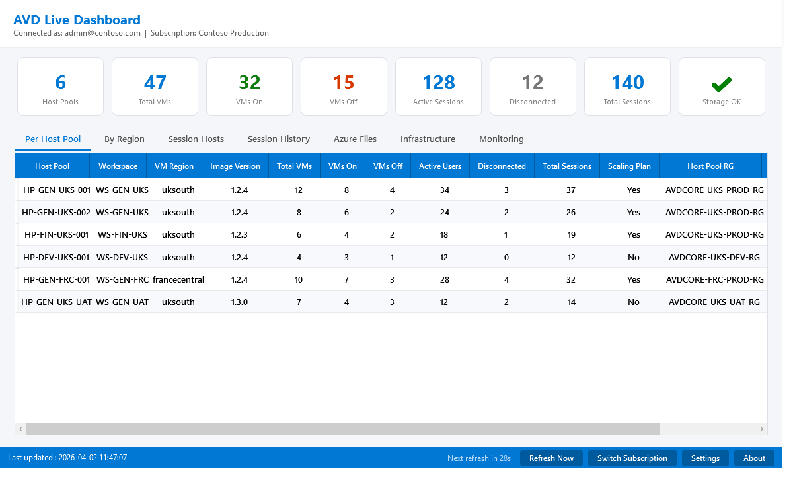
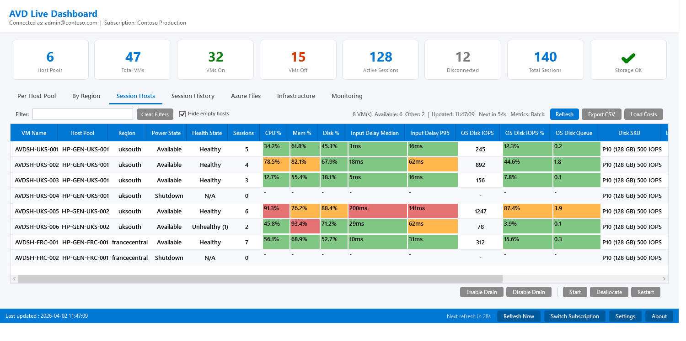
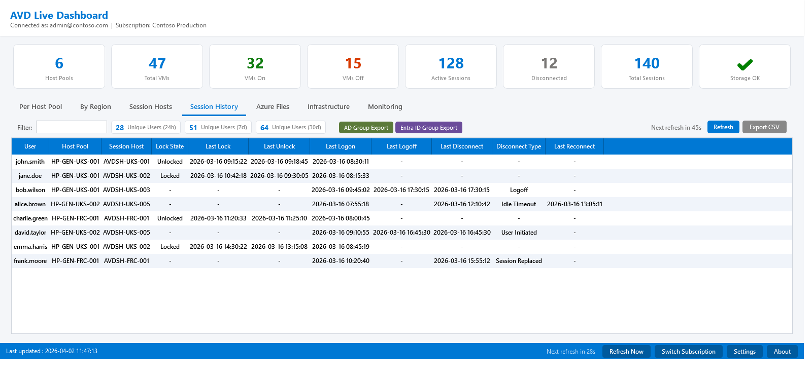
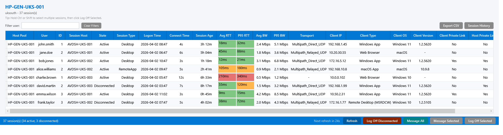
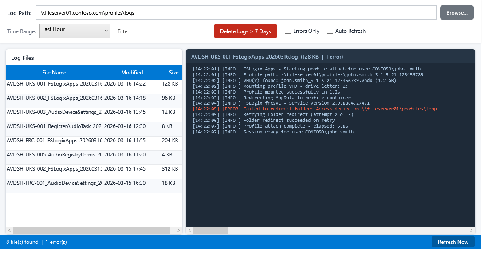

A Windows Presentation Foundation (WPF) live dashboard for monitoring Azure Virtual Desktop environments and Azure Files storage accounts within an Azure subscription. Provides real-time visibility into AVD infrastructure with a fully responsive UI — all data is collected in persistent background runspaces so the interface never freezes during refresh.

> **Disclaimer:** This script is provided as-is with no warranty, guarantee, or support of any kind. Use at your own risk. The author accepts no responsibility for any issues, data loss, or damages arising from the use of this script in any environment. Always test in a non-production environment before deploying.

---

## Files

| File | Description |
| --- | --- |
| `avd-live-dashboard.ps1` | Main dashboard script — do not edit per deployment |
| `profile-tools.ps1` | FSLogix profile management tool — can be run standalone or launched from the dashboard. Do not edit per deployment |
| `Launch-AVD-Dashboard.cmd` | Quick-launch shortcut — runs the dashboard with a hidden console window |
| `Launch-AVD-Dashboard-Select.cmd` | Quick-launch shortcut — prompts to choose between Device Authentication, Existing Context, PowerShell 7, or Service Principal before launching |
| `Launch-AVD-Dashboard-Logging.cmd` | Quick-launch shortcut — runs the dashboard with REST API logging enabled |
| `Launch-Profile-Tools.cmd` | Quick-launch shortcut — runs Profile Tools with a hidden console window |
| `Launch-Profile-Tools-Logging.cmd` | Quick-launch shortcut — runs Profile Tools with REST API logging enabled |
| `Check-AVD-Permissions.cmd` | Quick-launch shortcut — runs the Azure RBAC permissions checker |
| `Edit-AVD-Config.cmd` | Quick-launch shortcut — opens the WPF config editor |
| `config/config.psd1` | **Customer/environment configuration — edit this file for each deployment** |
| `config/EXAMPLE-config.psd1` | Annotated example configuration — copy to `config.psd1` and edit for your environment |
| `scripts/rest-api-helpers.ps1` | Azure ARM REST API helper functions — token management, pagination, retry logic, and resource-specific wrappers. Dot-sourced by avd-live-dashboard.ps1 and profile-tools.ps1 at startup |
| `scripts/storage-api-helpers.ps1` | Azure Files data plane REST API helper functions — supports both OAuth bearer token (primary) and SharedKey (HMAC-SHA256) authentication for file handle, lock file, and directory operations. Loaded as a string and injected into background runspaces by profile-tools.ps1 |
| `scripts/tab-sessionhosts.ps1` | Session Hosts tab module — dot-sourced by avd-live-dashboard.ps1 at startup |
| `scripts/tab-azurefiles.ps1` | Azure Files tab module — dot-sourced by avd-live-dashboard.ps1 at startup |
| `scripts/tab-monitoring.ps1` | Monitoring tab module — dot-sourced by avd-live-dashboard.ps1 at startup |
| `scripts/tab-infrastructure.ps1` | Infrastructure tab module — dot-sourced by avd-live-dashboard.ps1 at startup |
| `scripts/tab-azuredevops.ps1` | Azure DevOps tab module — dot-sourced by avd-live-dashboard.ps1 at startup. Displays pipeline definitions and recent runs; supports Run, Cancel, Delete, and View Log actions. PAT stored encrypted at `%APPDATA%\AVDDashboard\ado-pat.xml` |
| `scripts/session-detail.ps1` | Session detail windows, shadow, RDP and messaging — dot-sourced by avd-live-dashboard.ps1 at startup |
| `scripts/run-command.ps1` | Run Command engine (picker, execution, output, timer) — dot-sourced by avd-live-dashboard.ps1; called from Session Hosts and Session Detail context menus |
| `scripts/cost-lookup.ps1` | Cost fetch module for Session Hosts and Azure Files tabs — dot-sourced by avd-live-dashboard.ps1; queries the Azure Retail Prices API (no auth required) in background runspaces. Session Hosts: Compute GBP/mo, Disk GBP/mo, Txn GBP/10K. Azure Files: Storage GBP/mo. Currency, country, and Azure Hybrid Benefit toggle are configured at the top of this file |
| `scripts/tab-sessioninfo.ps1` | Session History tab module — dot-sourced by avd-live-dashboard.ps1 at startup |
| `scripts/adv-session-detail.ps1` | Advanced Session Detail module — dot-sourced by session-detail.ps1; queries LAW for lock/unlock and session lifecycle events per user across all hosts |
| `scripts/Check-Permissions.ps1` | Azure RBAC permissions checker — validates that the signed-in account holds all roles required by the dashboard and its supporting scripts |
| `scripts/edit-config.ps1` | WPF GUI editor for `config.psd1` — opens a tabbed form covering every section of the configuration file; saves a clean, fully commented PSD1 |
| `data/run-commands.psd1` | Predefined Run Command definitions — edit to add, remove or reorder commands without modifying the main scripts |
| `data/runcommands/*.ps1` | External script files referenced by `ScriptFile` entries in `run-commands.psd1` — complex commands stored as readable multi-line scripts |
| `data/kql/winlogon-stages.kql` | KQL query for the Monitoring tab Winlogon Stages bar chart — adapted from the AVD Insights workbook. Uses `{{TimeRange}}` and `{{HostPoolFilter}}` placeholder tokens |
| `data/kql/rtt-by-gateway.kql` | KQL query for the Monitoring tab RTT by Gateway Region grid — joins WVDConnectionNetworkData with WVDConnections. Uses `{{TimeRange}}` placeholder |
| `data/kql/winlogon-hostpools.kql` | KQL query for the Monitoring tab host pool filter dropdown — distinct host pool names from WVDConnections over 7 days |
| `data/kql/session-history.kql` | KQL query for the Monitoring tab Session History chart — two-stage aggregation of WVDAgentHealthStatus producing Active and Disconnected concurrent session counts per bin. Uses `{{DisplayStart}}`, `{{DisplayEnd}}`, `{{BinSize}}`, and `{{HostPoolFilter}}` placeholder tokens |
| `scripts/profile-sizes.ps1` | Background worker called by profile-tools.ps1 to enumerate profile folder sizes |
| `scripts/profile-cleanup.ps1` | Background worker called by profile-tools.ps1 to identify stale profile folders |
| `scripts/profile-delete-check.ps1` | Background worker (Phase 1) — checks for active FSLogix locks and open file handles via Azure Files REST API |
| `scripts/profile-delete-unlock.ps1` | Background worker (Phase 2) — closes file handles and removes lock files via Azure Files REST API |
| `scripts/profile-delete-remove.ps1` | Background worker (Phase 3) — deletes profile folders from UNC paths after locks are cleared |
| `scripts/audit-log.ps1` | Audit logging function (`Write-AuditLog`) — dot-sourced by avd-live-dashboard.ps1 and profile-tools.ps1; writes destructive actions to daily CSV files in the `logs/` subfolder |
| `tools/log-viewer.ps1` | Log Viewer tool — browse and view log files from a file share or local path with error highlighting. Can be run standalone or launched from the Azure Files tab |
| `tools/audit-viewer.ps1` | Audit Viewer tool — browse and filter audit log CSV files with date range, action type, and text search filters. Export filtered results to CSV |
| `Launch-Log-Viewer.cmd` | Quick-launch shortcut — runs the Log Viewer with a hidden console window |
| `data/avd-dashboard.ico` | Custom application icon — used by the dashboard, config editor, permissions checker, and log viewer windows |
| `screenshots/Generate-Screenshots.ps1` | Generates PNG screenshots of all windows using WPF off-screen rendering with mock data — no Azure connection required |

`avd-live-dashboard.ps1`, `profile-tools.ps1`, and the `config/`, `scripts/`, and `data/` subfolders must all be kept together in the same root folder. Both scripts load `config/config.psd1` on startup and will exit with an error dialog if the file is missing or contains a syntax error.

---

## Requirements

### PowerShell

PowerShell 5.1 (Windows PowerShell) or PowerShell 7 (pwsh.exe) on Windows. WPF is available in both on Windows; option `[3]` in `Launch-AVD-Dashboard-Select.cmd` runs under PowerShell 7.

### PowerShell Modules

The following Az PowerShell module must be installed. The script will detect if it is missing on launch and offer to install it automatically.

| Module | Purpose |
| --- | --- |
| `Az.Accounts` | Azure authentication and token acquisition |

All Azure data queries (host pools, session hosts, VMs, storage accounts, metrics, etc.) use direct Azure REST API calls with bearer tokens via `scripts/rest-api-helpers.ps1`. Profile Tools storage operations (lock detection, handle closure, file deletion) use the Azure Files data plane REST API with OAuth bearer token authentication via `scripts/storage-api-helpers.ps1` — no storage account keys are required. No other Az modules are required.

#### Optional Modules

| Module | Purpose |
| --- | --- |
| `Microsoft.Graph.Users` | Entra ID user enrichment in the Session History tab (populates First Name, Last Name, Department from Microsoft Graph). If not installed, the Entra ID button falls back to REST API calls using `Get-AzAccessToken`, which may fail with 401 if the Azure PowerShell app registration does not have `User.Read.All` consent in the tenant. Install with `Install-Module Microsoft.Graph.Users -Scope CurrentUser`. |
| `ActiveDirectory` | AD user enrichment in the Session History tab. Requires the RSAT Active Directory module to be installed on the admin machine. |

### Azure RBAC Roles

#### Main Dashboard

| Role | Scope |
| --- | --- |
| Desktop Virtualization Reader | All target host pools |
| Reader | All VM resource groups (also required for Infrastructure tab: covers VM and network interface queries on configured infrastructure resource groups) |
| Desktop Virtualization User Session Operator | All target host pools (required for log off) |
| Storage Account Reader | Target storage accounts |
| Monitoring Reader | Target storage accounts (required for metrics) |
| Log Analytics Reader | Log Analytics workspace(s) configured for AVD diagnostics (required for AVD Insights, Session Hosts CPU/Mem/Disk columns, and Performance History) |
| Tag Contributor | All VM resource groups (required only when the "Set scaling tag on drain" setting is enabled — allows setting/removing the scaling exclude tag on VMs during drain mode actions) |
| Cost Management Reader | Subscription (required for the **Load Costs** button — queries the Cost Management API for actual 30-day disk transaction charges on Session Hosts and Infrastructure tabs) |

#### Session History Tab (Entra ID Enrichment)

The Session History tab's **Enrich from Entra ID** button queries Microsoft Graph to populate user details. This requires the following Microsoft Graph API permission on the signed-in account or app registration:

| Permission | Type | Required for |
| --- | --- | --- |
| `User.Read.All` | Delegated or Application | Looking up user properties (givenName, surname, department) via Microsoft Graph. When using the `Microsoft.Graph.Users` module, `Connect-MgGraph` will prompt for consent on first use. |

The **Enrich from AD** button uses `Get-ADUser` from the RSAT Active Directory module and requires line-of-sight to a domain controller — no Azure RBAC role is needed.

#### Profile Tools

Profile Tools requires additional roles on each target storage account to support its three-phase FSLogix profile deletion workflow.

| Role | Scope | Required for |
| --- | --- | --- |
| Storage File Data Privileged Contributor | Target storage accounts | Phase 1 (lock detection) and Phase 2 (unlock). Grants OAuth access to the Azure Files data plane REST API for file listing, handle management, and lock file removal. No storage account keys are retrieved or used. |
| NTFS permissions (Modify or Full Control) | Profile file share folders | Phase 3 (profile folder deletion via UNC path using `Remove-Item`). Access is governed by NTFS permissions, not an Azure RBAC role. The account running the script must have Modify or Full Control on the target profile folders. |

### Network / Firewall

The following outbound FQDN must be reachable from the machine running the dashboard for the **Load Costs** feature to work. All other Azure REST API calls use the standard Azure management endpoints which are typically already permitted in corporate environments.

| FQDN | Port | Protocol | Feature | Auth required |
| --- | --- | --- | --- | --- |
| `prices.azure.com` | 443 | HTTPS / TLS 1.2 | Load Costs — compute and disk storage rate lookup (Azure Retail Prices API) | None — public API |
| `management.azure.com` | 443 | HTTPS / TLS 1.2 | Load Costs — actual 30-day disk transaction charges (Azure Cost Management Query API) | Azure AD bearer token (same credential used for all other dashboard ARM calls) |

> **Note:** `prices.azure.com` is a public, unauthenticated REST API. No Azure credentials or tokens are sent to this endpoint. `management.azure.com` is the standard Azure Resource Manager endpoint already required by all other dashboard features. If either endpoint is unreachable, the Load Costs button will time out and display an error — all other dashboard features are unaffected.

---

## Deployment

For each new customer or environment:

1. Copy all files (`avd-live-dashboard.ps1`, `profile-tools.ps1`, the `.cmd` launcher files, and the `config/`, `scripts/`, and `data/` subfolders) to a folder on the admin machine.
2. Copy `config/EXAMPLE-config.psd1` to `config/config.psd1` and update the values for the target environment (see [Configuration](#configuration) below). Use `Edit-AVD-Config.cmd` to open the WPF editor, or edit the file directly.
3. Optionally run `Check-AVD-Permissions.cmd` to verify the signed-in account holds the required Azure RBAC roles before launching the dashboard.
4. Run the dashboard — the scripts themselves never need to be modified.

---

## Usage

```powershell
.\avd-live-dashboard.ps1
```

```powershell
# Override the AVD refresh interval at launch
.\avd-live-dashboard.ps1 -RefreshIntervalSeconds 60
```

```powershell
# Use device code authentication instead of interactive browser sign-in
.\avd-live-dashboard.ps1 -UseDeviceAuthentication
```

```powershell
# Use a service principal for non-interactive authentication
.\avd-live-dashboard.ps1 -UseServicePrincipal
```

```powershell
# Enable REST API call logging to a timestamped file in %TEMP%
.\avd-live-dashboard.ps1 -EnableLogging
```

```powershell
# Use an alternative config file (e.g. for a different customer/environment)
.\avd-live-dashboard.ps1 -ConfigFile "C:\Configs\prod-config.psd1"
```

The `.cmd` launcher files in the root folder provide quick-launch shortcuts without needing to open a PowerShell window. `Launch-AVD-Dashboard-Select.cmd` presents a numbered menu: **[1] Device Authentication** (opens with a visible console window so the device code prompt is readable), **[2] Existing Context**, **[3] PowerShell 7**, and **[4] Service Principal**.

The script will prompt for Azure sign-in if no active context is found. Once authenticated, a brief splash screen is shown while runspaces initialise, then the main dashboard opens.

`profile-tools.ps1` can also be run independently — it does not require the main dashboard to be open. It reads the same `config/config.psd1` and will prompt for Azure sign-in if needed. A splash screen with progress bar is shown during startup.

```powershell
.\profile-tools.ps1
```

```powershell
# Enable REST API call logging
.\profile-tools.ps1 -EnableLogging
```

```powershell
# Use an alternative config file
.\profile-tools.ps1 -ConfigFile "C:\Configs\prod-config.psd1"
```

---

## Authentication

The dashboard supports four authentication modes, selectable at launch:

| Switch | CMD option | Description |
| --- | --- | --- |
| *(none)* | — | Interactive browser sign-in (default). Opens a browser popup for the signed-in user. |
| `-UseDeviceAuthentication` | `[1]` | Device code flow. Prints a URL and one-time code to the console; useful when a browser popup is blocked by a proxy. Requires a visible console window — option `[1]` in `Launch-AVD-Dashboard-Select.cmd` handles this automatically. |
| `-UseExistingContext` | `[2]` | Skips authentication entirely and uses an existing `Az` context from a prior `Connect-AzAccount` call in the same session. |
| `-UseServicePrincipal` | `[4]` | Non-interactive service principal authentication using a stored App ID and Client Secret (see below). |

### Service Principal Authentication

Service principal authentication allows the dashboard to connect to Azure without any user interaction — useful for shared admin machines, automated environments, or scenarios where interactive browser sign-in is not practical.

#### How It Works

1. **First launch** (`-UseServicePrincipal` or option `[4]`): A WPF dialog prompts for the **App (Client) ID** and **Client Secret** of the service principal.
2. The credential is saved as a **DPAPI-encrypted PSCredential file** at `%APPDATA%\AVDDashboard\` using PowerShell's `Export-Clixml`. DPAPI binds the encryption to the current Windows user account and machine — the file cannot be decrypted by any other user or on any other machine.
3. **Subsequent launches**: The credential is loaded silently from the file with `Import-Clixml` and no prompt is shown.
4. If sign-in fails (e.g. the secret has expired or been rotated), the dashboard offers to **clear the saved credential** so fresh details can be entered on the next launch.

> No secrets are stored in `config.psd1` or anywhere else in plain text. The encrypted file lives entirely within the user's own AppData profile.

#### Multiple Service Principals

Each config file gets its own isolated credential file, derived from the config filename:

| Config file | Credential file |
| --- | --- |
| `config.psd1` (default) | `sp-credential.xml` |
| `prod.psd1` | `sp-credential-prod.xml` |
| `customer-a.psd1` | `sp-credential-customer-a.xml` |

This allows different environments to use different service principals without conflict. Combine with `-ConfigFile` to switch between environments:

```powershell
.\avd-live-dashboard.ps1 -UseServicePrincipal -ConfigFile "config\prod.psd1"
```

#### Setup

1. In Azure Active Directory (Entra ID), register an App Registration and note the **Application (Client) ID** and the **Tenant ID**.
2. Create a **Client Secret** on the app registration and copy the value immediately — it is only shown once.
3. Assign the required RBAC roles (see [Azure RBAC Roles](#azure-rbac-roles)) to the service principal (the app registration's Object ID) at the appropriate scope.
4. Ensure `Azure.TenantId` is set in `config.psd1` — this is required for service principal authentication (unlike interactive sign-in where it is optional).
5. Launch with option `[4]` from `Launch-AVD-Dashboard-Select.cmd`, or pass `-UseServicePrincipal` directly. Enter the App ID and Client Secret when prompted. The credential is saved and subsequent launches will be fully silent.

#### Rotating the Secret

When a client secret expires:

1. Generate a new secret on the app registration in Entra ID.
2. Launch the dashboard with `-UseServicePrincipal`. Sign-in will fail with an authentication error.
3. When prompted, choose **Yes** to clear the saved credential.
4. Relaunch — the prompt will appear again to enter the new secret.

Alternatively, delete the corresponding credential file from `%APPDATA%\AVDDashboard\` manually before relaunching (see [Multiple Service Principals](#multiple-service-principals) for the naming convention).

#### Compatibility with Profile Tools

When launched from the dashboard's **Profile Tools** button, Profile Tools inherits the Azure context from the parent PowerShell session. No additional configuration is needed. When run standalone, Profile Tools uses `Get-AzContext` and will prompt for sign-in if no active context exists.

---

## Configuration

All customer and environment-specific settings live in `config/config.psd1` — a PowerShell Data File. It supports full `#` comments, native arrays and hashtables, and UNC paths written without any escaping. The annotated `config/EXAMPLE-config.psd1` documents every available setting with inline comments and example values. Use `Edit-AVD-Config.cmd` to edit the file via the WPF GUI editor.

The file is divided into the following sections:

### Azure Connection

```powershell
Azure = @{
    # Tenant ID to connect to on sign-in.
    # Leave as '' to use the default tenant for the signing-in account.
    TenantId = ''

    # Subscription ID to set as active after sign-in.
    # Leave as '' to use whichever subscription the context defaults to.
    SubscriptionId = ''
}
```

### Azure Files

```powershell
AzureFiles = @{
    # Storage account kinds to include.
    # FileStorage = premium file share accounts (dedicated FileStorage SKU)
    # StorageV2   = general-purpose v2 accounts hosting standard file shares
    StorageAccountKinds = @('FileStorage', 'StorageV2')

    # Resource groups containing storage accounts to monitor.
    # Leave as @() to scan all matching accounts across the entire subscription.
    # Wildcards supported (e.g. '*-FILES-*', 'RG-AVD-*').
    FilesRGs = @('RG-AVD-FILES-UKS', 'RG-AVD-FILES-UKW')

    # Percentage used at which the amber warning card appears on the dashboard.
    StorageWarningPct = 90
}
```

### AVD Host Pools

```powershell
AVDHostPools = @{
    # Limit AVD queries to specific resource groups (leave as @() for all).
    # Wildcards supported (e.g. 'AVDCORE-*', '*-PROD-RG').
    IncludeRGs = @()

    # Exclude specific resource groups from AVD queries (applied after IncludeRGs).
    # Wildcards supported (e.g. '*-UAT-*', '*-TEST-*').
    ExcludeRGs = @()

    # Host pool name patterns sorted to the bottom of the Per Host Pool tab.
    LowPriorityPatterns = @('-UAT', '-TEST')

    # Azure regions treated as secondary — rows with sessions here are highlighted red.
    SecondaryRegions = @('francecentral')

    # Whether secondary region highlighting is on by default.
    SecondaryRegionHighlightEnabled = $true

    # Host pools to exclude from all views and data queries (exact name, case-insensitive).
    # Can also be managed at runtime via the Settings UI.
    ExcludedHostPools = @()

    # Substrings to split session hosts into A and B groups for image version comparison.
    # Matched case-insensitively against VM short hostnames. Leave both empty to disable.
    HostGroupPatterns = @{ A = '-A-'; B = '-B-' }

    # Columns to hide in the Per Host Pool grid. Leave as @() to show all columns.
    # Valid names: 'Host Pool', 'Workspace', 'VM Region', 'Image Version A',
    #              'Image Version B', 'Total VMs', 'VMs Available', 'VMs Not Available',
    #              'VMs Drained', 'Active Users', 'Disconnected', 'Total Sessions',
    #              'Scaling Plan', 'Max Sessions', 'Load Balancer', 'Validation',
    #              'Start VM on Connect', 'Host Pool RG', 'Scope', 'HP Location'
    HiddenColumns = @()

    # Tag name checked on session host VMs to show scaling exclusion.
    ScalingExcludeTag = 'ExcludeFromScaling'
}
```

### Dashboard

```powershell
Dashboard = @{
    # Tabs to fully collapse from the tab strip. Leave as @() to show all tabs.
    # Valid names: 'Per Host Pool', 'By Region', 'Session Hosts',
    #              'Azure Files', 'Monitoring', 'Infrastructure', 'Azure DevOps'
    HiddenTabs = @('Azure DevOps')  # Azure DevOps hidden by default until configured

    # Hide the Settings button from the toolbar. When $true, settings can only be
    # changed by editing config.psd1 directly. Default: $false.
    HideSettingsButton = $false

    # Hide the Advanced Session Detail button in Session Detail windows.
    # When $true, the button is removed from the toolbar. Default: $false.
    HideSessionHistory = $false

    # Audit logging - records destructive actions to daily CSV files in logs/.
    # Default: $true (enabled).
    EnableAuditLog = $true
}
```

### Infrastructure Servers

```powershell
InfrastructureServers = @{
    # Resource groups containing infrastructure VMs to display in the Infrastructure tab.
    # Leave as @() to show an empty tab (a status bar message is shown instead of querying Azure).
    # Wildcards supported (e.g. 'RG-INFRA-*', '*-SERVERS-*').
    # Can also be managed at runtime via the Settings UI without restarting.
    ResourceGroups = @('RG-INFRA-UKS', 'RG-INFRA-UKW')

    # VM name substrings to exclude from the Infrastructure tab (case-insensitive substring match).
    # Leave as @() to include all VMs in the configured resource groups.
    ExcludePatterns = @('-TEMP', '-OLD')
}
```

### Azure DevOps

```powershell
AzureDevOps = @{
    # Full URL to your Azure DevOps organisation and project.
    # Format: 'https://dev.azure.com/<organisation>/<project>'
    # Leave as '' to disable the tab (configure via the Set PAT dialog instead).
    OrganisationUrl = 'https://dev.azure.com/contoso/MyProject'

    # How often the pipeline list auto-refreshes (seconds). Default: 30.
    RefreshIntervalSeconds = 30
}
```

The Azure DevOps tab is hidden by default (`HiddenTabs = @('Azure DevOps')` in `config.psd1`). To enable it, remove `'Azure DevOps'` from `HiddenTabs` and configure the tab using the **Set PAT** button in the tab toolbar.

#### Personal Access Token (PAT)

The tab authenticates to Azure DevOps using a Personal Access Token. The PAT is entered via the **Set PAT** button and stored encrypted on disk — it is never stored in `config.psd1` or anywhere in plain text.

**Creating a PAT:**

1. In Azure DevOps, go to **User Settings → Personal Access Tokens**.
2. Click **New Token**.
3. Give it a name (e.g. `AVD Dashboard`), set an expiry, and grant **Read** scope under **Build (Pipelines)**.
4. Copy the token value immediately — it is only shown once.
5. In the dashboard, click **Set PAT**, paste the token, and click **Save**.

**PAT storage:**

| Detail | Value |
| --- | --- |
| File location | `%APPDATA%\AVDDashboard\ado-pat.xml` |
| Full path (typical) | `C:\Users\<username>\AppData\Roaming\AVDDashboard\ado-pat.xml` |
| Encryption | Windows DPAPI via `Export-Clixml` — bound to the current Windows user account and machine |
| Portability | Cannot be decrypted by another user or on another machine |

To clear the stored PAT, either click **Set PAT**, leave the token field blank, and click **Save** — or manually delete `%APPDATA%\AVDDashboard\ado-pat.xml`.

#### Tab Features

| Feature | Description |
| --- | --- |
| Folder tree | Left pane shows pipeline folders. Click a folder to filter runs on the right. |
| Runs grid | Recent pipeline runs with status, result, branch, queue time, duration, and trigger. |
| Run Pipeline | Right-click a pipeline → **Run Pipeline** — choose branch, fill in YAML parameters, optionally skip stages. |
| Cancel Run | Right-click an in-progress run → **Cancel Run**. |
| Delete Run | Right-click a completed run → **Delete Run**. |
| View Log | Right-click any run → **View Log** — opens a scrollable popup with the full build log. |
| Auto-refresh | Pipeline list refreshes every `RefreshIntervalSeconds` seconds (default 30) while the tab is visible. |

---

### Shadow / RDP

```powershell
ShadowRDP = @{
    # Shadow tool: 'MSTSC' (Remote Desktop) or 'MSRA' (Remote Assistance).
    ShadowMethod = 'MSTSC'

    # $true = resolve VM private IP for shadow/RDP; $false = use DNS hostname.
    ShadowUseIP = $false
}
```

### FSLogix / Profile Tools

```powershell
ProfileTools = @{
    # Storage accounts for FSLogix profile searches.
    # Key   = storage account short name (no domain suffix)
    # Value = full UNC path to the folder where profile folders live (i.e. the parent of <username> folders)
    StorageAccountShareMap = @{
        'storageaccount01' = '\\storageaccount01.file.core.windows.net\profiles\fslogix'
        'storageaccount02' = '\\storageaccount02.file.core.windows.net\profiles\fslogix'
    }

    # Accounts to exclude from profile tool tabs and scans (still checked during deletion).
    # Leave as @() to include all accounts.
    ExcludeStorage = @('storageaccount01')

    # Azure File Share name (the share itself — must match the share name in the UNC paths above).
    # e.g. if UNC paths are \\account.file.core.windows.net\profiles\... then FileShareName = 'profiles'
    FileShareName = 'profiles'

    # Sub-path within the file share where profile folders live.
    # e.g. 'fslogix' if profiles are at \\share\profiles\fslogix\<username>
    # Leave as '' if profiles are directly at the share root (\\share\<sharename>\<username>).
    FileShareSubPath = 'fslogix'

    # Maps a substring of a storage account name to a human-readable Azure region label.
    # Used to display the region badge on Storage Location cards.
    # Key = substring to match (case-insensitive), Value = label to display.
    # Defaults to 'Azure' if no match is found.
    RegionLabels = @{
        'ukw' = 'UK West'
        'uks' = 'UK South'
        'frc' = 'France Central'
    }
}
```

### Log Analytics

```powershell
LogAnalytics = @{
    # Full ARM resource ID of the Log Analytics workspace that receives
    # AVD session host performance data (CPU / Memory / Disk from the Perf table).
    # Leave as '' to disable the CPU %, Mem %, and Disk % columns in the Session Hosts tab.
    # Example: '/subscriptions/00000000-0000-0000-0000-000000000000/resourceGroups/RG-LOGS/providers/Microsoft.OperationalInsights/workspaces/my-law-workspace'
    WorkspaceResourceId = ''
}
```

> All settings saved via the **Settings UI** take priority over `config.psd1` defaults. When a display/filter setting has never been saved via Settings (empty registry value), the config.psd1 default is used. Deleting the `HKCU:\Software\AVDDashboard` registry key resets everything back to config.psd1 defaults. Set `Dashboard.HideSettingsButton = $true` in config.psd1 to remove the Settings button entirely.

---

## Dashboard Features

### Summary Cards

A row of cards at the top of the dashboard shows subscription-wide totals at a glance:

- **Host Pools** — total number of host pools found
- **Total VMs / VMs Available / VMs Not Available** — session host counts across all pools
- **Active Sessions** — click to open a cross-pool session viewer filtered to active sessions
- **Disconnected** — click to open a cross-pool session viewer filtered to disconnected sessions
- **Total Sessions** — click to open a cross-pool session viewer showing all sessions
- **Storage** — always visible; shows a green tick when all shares are healthy, or an amber warning with the worst offender when any share exceeds the configured usage threshold. Click to jump to the Azure Files tab.

### Per Host Pool Tab

Displays one row per host pool (split by region where a pool spans multiple regions) with:

- Host Pool name, Workspace, VM Region, Image Version A, Image Version B, Host Pool Resource Group
- Total VMs, VMs Available, VMs Not Available
- Active Users, Disconnected, Total Sessions
- Scaling Plan status

**Double-click any row** to open a session detail window for that host pool.

Image Version A and B columns show the image version for each host group (e.g. blue/green sets). Configure `HostGroupPatterns` in `config.psd1` with substrings to match against VM names. When a group has no VMs, its column shows "N/A".

Low-priority host pools (matching patterns defined in `LowPriorityPatterns` in `config.psd1`) are sorted to the bottom of the list.

Rows where sessions are running in a secondary region (configured via `SecondaryRegions` in `config.psd1`) are highlighted red. This can be toggled in Settings.

### By Region Tab

Aggregates all host pool data by Azure region, showing combined VM and session counts per region.

### Azure Files Tab

Lists all storage accounts matching the configured kinds (default: `FileStorage` and `StorageV2`) within the configured resource groups, showing per-share:

- Quota (GiB), Used (GiB), Free (GiB), Used %, Storage GBP/mo

Data is fetched via Azure Monitor metrics REST API. A **Profile Tools** button launches `profile-tools.ps1` for FSLogix profile management tasks. A **Log Viewer** button launches `tools/log-viewer.ps1` for browsing and viewing log files on file shares.

**Storage GBP/mo** is populated on demand by clicking the green **Load Costs** button in the toolbar. Prices are fetched from the [Azure Retail Prices API](https://prices.azure.com/api/retail/prices) in a background runspace — no Azure authentication required.

| Share type | Billed on | API product |
| --- | --- | --- |
| Premium (FileStorage / Premium_LRS or Premium_ZRS) | Provisioned quota — you pay for the full quota whether or not it is used | `Azure Premium Files` |
| Standard — TransactionOptimized or Hot | Consumed (used) capacity | `Azure Files` |
| Standard — Cool | Consumed (used) capacity | `Azure Files Cool` |

Replication type (LRS / ZRS / GRS) is derived from the storage account SKU and included in the API filter so pricing reflects the account's actual replication configuration. One API call is made per unique product+replication+region combination — multiple shares in the same account share a single call. Costs are cached and reapplied automatically on every subsequent auto-refresh without re-calling the API. Click Load Costs again to refresh with new prices.

> **Note:** Transaction costs (per-operation charges on standard tiers) are not included as they depend on actual I/O volume. The Storage GBP/mo figure covers capacity storage charges only. Requires outbound HTTPS access to `prices.azure.com` — see [Network / Firewall](#network--firewall).

### Session Hosts Tab

Displays all session hosts across every host pool in a single filterable grid showing:

- VM Name, Host Pool, Region, Power State, Health State, Sessions, CPU %, Mem %, Disk %, Input Delay Median, Input Delay P95, Disk IOPS, Disk IOPS %, Disk Queue, Drain Mode, Last Heartbeat, Agent Version, OS Version, Disk SKU, Compute GBP/mo, Disk GBP/mo, Txn GBP/10K

**CPU %**, **Mem %**, and **Disk %** are populated from Log Analytics Workspace at each refresh (Available VMs only) and colour-coded with a heat map: green below 75%, amber 75-89%, red 90%+. **Disk %** shows C: drive used space. **Input Delay Median** and **Input Delay P95** show user input delay in milliseconds over the last hour. P95 (95th percentile) filters out extreme outliers and matches the metric used by the Microsoft AVD Insights workbook. All LAW-based metric columns show `-` when the VM is not Available or when `LogAnalytics.WorkspaceResourceId` is not configured.

**Disk IOPS**, **Disk IOPS %**, and **Disk Queue** are populated from the Azure Monitor Metrics API — these are platform-level metrics from the Azure hypervisor, requiring no guest agent or Log Analytics Workspace. They are queried using the **Azure Monitor regional batch metrics API** (`{region}.metrics.monitor.azure.com/subscriptions/{subId}/metrics:getBatch`), which batches up to 50 VMs per API call grouped by region — reducing N per-VM calls to `ceil(N/50)` calls. In Azure Monitor Private Link Scope (AMPLS) environments where the regional batch endpoint is not DNS-resolvable, the dashboard automatically falls back to individual per-VM single-resource GET calls via `management.azure.com` on a per-region basis. The status bar shows which path is active: **Metrics: Batch**, **Metrics: Per-VM**, or **Metrics: Batch (region) + Per-VM (region)** for mixed environments.

- **Disk IOPS** — combined OS Disk read + write operations per second. Informational only (no heat map), since IOPS thresholds are workload-dependent.
- **Disk IOPS %** — current IOPS as a percentage of the disk's provisioned IOPS limit (derived from the disk tier lookup table). Heat map coloured: green below 75%, amber 75-89%, red 90%+. Shows how close the disk is to its Azure-imposed IOPS cap.
- **Disk Queue** — OS Disk queue depth (average number of pending I/O requests). Heat map coloured: green below 2, amber 2-4, red 5+. A sustained value above 2 indicates the disk may be a bottleneck.

These metrics are always available for running VMs regardless of LAW configuration. Toggle visibility via `$script:ShowDiskPerf` in `tab-sessionhosts.ps1`.

**Disk SKU** shows the Azure managed disk tier, provisioned size, and IOPS limit — e.g. `P10 (128 GB) 500 IOPS` or `E10 (128 GB) 500 IOPS`. The tier and IOPS are derived from a built-in lookup table matching the disk's storage type and size to the Azure managed disk pricing tiers (Premium SSD, Standard SSD, Standard HDD).

**Compute GBP/mo**, **Disk GBP/mo**, and **Txn GBP/10K** are populated on demand by clicking the green **Load Costs** button in the toolbar. Prices are fetched from the [Azure Retail Prices API](https://prices.azure.com/api/retail/prices) — a public, unauthenticated REST API — in a background runspace so the UI stays responsive.

| Column | Description |
| --- | --- |
| Compute GBP/mo | Estimated monthly compute cost: hourly VM rate × 730 hours. Shows `0.00` for deallocated VMs (no compute charge when stopped). Shows `-` if no price was returned for that SKU/region. |
| Disk GBP/mo | Fixed monthly managed disk cost (LRS tier). Applies regardless of VM power state. |
| Txn GBP/10K | Per 10,000 disk I/O transaction charge. Only applies to Standard SSD and Standard HDD — Premium SSD shows `-` as it has no transaction fees. |

Each unique VM SKU + region combination makes a single API call, so 20 VMs all running the same SKU in the same region result in one compute API call and one disk API call. Prices are cached after the first fetch and reapplied automatically on every subsequent grid refresh — no re-fetch until Load Costs is clicked again.

**Azure Hybrid Benefit (AHB):** If your VMs use AHB (bring-your-own Windows Server licence via Software Assurance), set `$script:UseAHBPricing = $true` at the top of `scripts/cost-lookup.ps1`. This switches the compute price to the base/Linux rate (no Windows licence fee), which is what Azure bills for AHB-enabled VMs. The default (`$false`) fetches the standard Windows PAYG rate with the licence cost included.

Currency and country are configurable at the top of `scripts/cost-lookup.ps1` (`$script:PricingCurrency` and `$script:PricingCountryCode`). Defaults: GBP / GB. Requires outbound HTTPS access to `prices.azure.com` — see [Network / Firewall](#network--firewall).

**Power State** reflects the AVD agent-reported state: Available, Shutdown, Unavailable, NoHeartbeat, etc. A deallocated VM shows **Shutdown** — the Azure Compute allocation state (Deallocated/Running) is a separate layer not queried by this tab. **Health State** summarises the session host health check results: Healthy, Unhealthy (N), or N/A when the VM is powered off and the agent is not running. **Drain Mode** shows whether the session host is accepting new sessions (On = accepting, Off = draining).

A **Filter** box at the top filters the grid across all columns in real time. The status bar shows a live count of Running vs Other VMs and a countdown to the next scheduled refresh.

**Power actions** are available via buttons at the bottom of the tab (multi-select supported with Ctrl/Shift+click):

| Button | Action |
| --- | --- |
| Start Selected | Starts all selected deallocated VMs |
| Deallocate Selected | Deallocates all selected running VMs |
| Restart Selected | Restarts all selected VMs |

**Drain mode** buttons are also available:

| Button | Action |
| --- | --- |
| Enable Drain | Blocks new sessions on selected session host(s) |
| Disable Drain | Allows new sessions on selected session host(s) |

When the **"Set/remove scaling exclude tag when enabling/disabling drain mode"** setting is enabled (on by default in Settings), drain mode actions also automatically set or remove the configured scaling exclude tag on the VM resource. This prevents the Azure autoscaler from starting a drained host. The tag operation uses the Microsoft.Resources Tags API with Merge/Delete semantics, which safely adds or removes only the specified tag without affecting any other tags on the VM. If the tag operation fails (e.g. insufficient permissions), the drain mode change is aborted and the error is shown in the status bar — this ensures the scaling plan and drain mode stay in sync.

All power and drain actions run asynchronously in a background runspace — the UI remains responsive and buttons are re-enabled once the action completes. A **Refresh VMs** button triggers an immediate out-of-schedule refresh.

Data refreshes automatically every 60 seconds from a dedicated background runspace, independent of the main 30-second AVD refresh. **Ctrl+MouseWheel** zooms the grid between 60% and 150% to fit more or fewer rows on screen.

**Right-click context menu** on any session host row:

| Option | Available when |
| --- | --- |
| Copy Hostname | Row selected |
| Copy IP Address | Row selected |
| Performance History | Row selected and LAW configured |
| RDP to Session Host | Power State is not Shutdown |
| Run Command... | Power State is not Shutdown |

**Performance History** opens a popup with two chart panels:

- **Top chart** — CPU % and Mem % over time, queried from Log Analytics Workspace (KQL against the Perf table). Includes amber (75%) and red (90%) threshold lines matching the grid heat map.
- **Bottom chart** — Disk IOPS and Queue Depth over time, queried from the Azure Monitor Metrics API (platform metrics, no LAW required). Uses a dual Y-axis: IOPS on the left (green, auto-scaled) and Queue Depth on the right (orange, auto-scaled). A unified legend at the top right identifies all four series.

The time range is selectable (1 hour, 4 hours, 12 hours, 24 hours) and applies to both charts simultaneously. The top chart is blank when `LogAnalytics.WorkspaceResourceId` is not configured; the bottom chart always works for running VMs.

RDP and Run Command are greyed out when the session host's Power State is **Shutdown** (VM stopped or deallocated) — RDP cannot connect and Run Command hangs against a non-running VM.

### Session History Tab

Queries Log Analytics Workspace for user lock/unlock and session lifecycle events across all host pools over the last 24 hours. Data refreshes automatically with a configurable countdown timer. A **Filter** box filters across all columns in real time.

The tab displays:

- User, Session Host, Lock State, Last Lock/Unlock, Last Logon/Logoff, Last Disconnect, Disconnect Type, Last Reconnect

**Unique Users tiles** at the top show the count of distinct users seen in the last 24 hours, 7 days, and 30 days. Click any tile to open a **Unique Users popup** with a detailed breakdown:

- User, First Name, Last Name, Department, Last Logon, Sessions

The popup provides:

| Button | Action |
| --- | --- |
| Enrich from AD | Populates First Name, Last Name, and Department using batched LDAP queries (chunks of 50 users). Requires the RSAT `ActiveDirectory` module and line-of-sight to a domain controller. |
| Enrich from Entra ID | Populates the same fields using batched Microsoft Graph queries (chunks of 15 users in 3 passes: `onPremisesSamAccountName`, `mailNickname`, UPN prefix). Requires the `Microsoft.Graph.Users` module and `User.Read.All` permission. On first use, `Connect-MgGraph` prompts for consent. Falls back to REST API if the module is not installed. |
| Export CSV | Saves all rows (including enriched columns) to a CSV file. |

Both enrichment buttons can be clicked multiple times - they re-query and overwrite previous values. A footer status bar shows progress and results.

**Group Export buttons** on the main tab toolbar:

| Button | Action |
| --- | --- |
| AD Group Export | Prompts for an AD group name, recursively enumerates all user members via `Get-ADGroupMember -Recursive`, batch-fetches user details (SamAccountName, Name, Department, Email, Title) using LDAP filter queries, and exports to CSV via a Save dialog. Requires the RSAT `ActiveDirectory` module. |
| Entra ID Group Export | Prompts for an Entra ID group name, looks up the group via `Get-MgGroup`, enumerates members via `Get-MgGroupMember`, batch-fetches full user details (DisplayName, Name, Department, JobTitle, Mail, UPN) in chunks of 15, and exports to CSV. Requires `Microsoft.Graph.Groups` and `Microsoft.Graph.Users` modules with `GroupMember.Read.All` and `User.Read.All` permissions. |

**Lock State intelligence** - the Lock State column only shows "Locked" or "Unlocked" when the user has an active session. If the session ended (logoff or disconnect) after the last lock/unlock event, the state resets to `-` to avoid stale data.

**Right-click context menu** on any row in the main tab grid:

| Option | Action |
| --- | --- |
| View User Timeline | Opens a combined timeline popup merging lock/unlock events (Security 4800/4801) and session lifecycle events (Logon, Logoff, Disconnect, Reconnect) into a single chronological view. Disconnect events are enriched with reason codes. Time range is selectable (12h to 7d). |

Requires `LogAnalytics.WorkspaceResourceId` to be configured in `config.psd1`.

### Infrastructure Tab

Displays a filterable grid of plain Azure VMs from one or more configured resource groups — intended for domain controllers, file servers, and other infrastructure VMs that sit alongside an AVD deployment. Unlike the Session Hosts tab, this tab queries Azure Compute directly rather than the AVD agent layer.

Columns shown:

- VM Name, Resource Group, Region, Power State, OS Type, IP Address, VM SKU, Avail Zone

**Power State** reflects the Azure Compute allocation state (e.g. `VM running`, `VM deallocated`). **IP Address**, **VM SKU** and **Avail Zone** are resolved automatically on every refresh via Azure REST API queries — no on-demand button is required.

**Power actions** are available via buttons at the bottom of the tab (multi-select supported):

| Button | Action |
| --- | --- |
| Start | Starts selected deallocated VMs |
| Deallocate | Deallocates selected VMs (releases compute billing) — requires confirmation |
| Restart | Restarts selected VMs — requires confirmation |

A **Filter** box at the top filters across VM Name, Resource Group, Power State and OS Type. The status bar shows a live count and a countdown to the next scheduled refresh (60 seconds). **Export CSV** saves all rows to a CSV file. Right-clicking any row offers **RDP to Server**.

Resource groups are configured via `InfrastructureServers.ResourceGroups` in `config.psd1` and can also be updated at runtime via **Settings** without restarting the dashboard.

### Monitoring Tab

The Monitoring tab provides three data visualisations sourced from Log Analytics, plus a direct link to Azure Virtual Desktop Insights in the Azure Portal.

**Toolbar**: The top row contains the **Open AVD Insights in Azure Portal** button, a **Time Range** selector (1 hour through 30 days, plus Custom Range), a **Host Pool** filter dropdown (populated from WVDConnections data), a legend, and a **Refresh** button. Changing the time range or host pool automatically triggers a refresh after a 100 ms debounce. The tab also auto-refreshes when first selected.

**Winlogon Stages** (left panel): A grouped bar chart showing the breakdown of user logon time into stages, adapted from the AVD Insights workbook. Each stage shows two bars: P95 (magenta — worst-case 95th percentile) and P50 (grey — typical median). A summary line at the top shows the total P50 and P95 logon times. Hovering over a stage name shows a tooltip with the Microsoft documentation description of that stage and what causes slow times.

The logon stages are derived from the `LogonDelay` checkpoint in the `WVDCheckpoints` table, which records per-stage timing in its Parameters bag:

| Stage | Internal Name | Description |
| --- | --- | --- |
| Group policy | GPClient | Time to apply Group Policy Objects to new sessions. High values indicate too many GPOs or slow domain controllers. |
| FSLogix | frxsvc | Time to launch FSLogix and mount the profile container. High values indicate slow storage, large profiles, or shares not collocated with session hosts. |
| User Auth. | AuthenticateUser | Time to authenticate user credentials during the logon process. |
| Shell | WinLogon_StartShell | Time to launch the Windows shell (explorer.exe). |
| Others | (catch-all) | Aggregate of all other logon sub-tasks not individually categorised. |

The Host Pool filter applies only to the Winlogon Stages chart (the RTT grid shows all regions regardless).

**RTT by Gateway Region** (right panel): A data grid showing round-trip time statistics grouped by the Azure RD Gateway region users connect through. Data is sourced from `WVDConnectionNetworkData` joined with `WVDConnections`. Columns: Gateway Region, Users (distinct count), Median RTT, P95 RTT, Peak RTT, and Peak Time (timestamp of the peak). Helps identify network latency issues affecting specific regions.

**Session History** (bottom panel): A two-series line chart showing concurrent session counts over time, using the same data source as the Azure Portal host pool overview. Numbers match the Active / Disconnected / Total summary cards on the dashboard.

- **Active** (blue line) — users actively at the keyboard
- **Disconnected** (orange line) — sessions still alive but the user has disconnected (session idle, not logged off)

The chart uses `WVDAgentHealthStatus`, which is written by each AVD session host agent approximately every 30 seconds and contains exact `ActiveSessions` and `InactiveSessions` counts per host at that moment. A two-stage aggregation is applied:

1. **Per host per bin** — `percentile(x, 100)` (equivalent to max) takes the peak reading for each session host within the bin. This avoids inflating counts by summing the ~60 near-identical rows that each host writes per 30-minute window.
2. **Sum across all hosts** — per-host peaks are summed to give the fleet-wide total per bin.

Hovering over the chart shows a crosshair with a tooltip displaying the exact bin time and both session counts.

**Bin sizes** are chosen automatically based on the selected time range to balance resolution against query size:

| Time Range | Bin Size | Approx. Data Points |
| --- | --- | --- |
| Last 1 Hour | 5 minutes | ~12 |
| Last 4 Hours | 15 minutes | ~16 |
| Last 8 / 12 Hours | 30 minutes | ~16–24 |
| Last 24 / 48 Hours | 30 minutes | ~48–96 |
| Last 7 Days | 1 hour | ~168 |
| Last 30 Days | 1 hour | ~720 |
| Custom Range | 30 min (≤24h) / 1h (>24h) | varies |

**Result caching** — query results are cached in memory for the duration of the dashboard session. Switching between time ranges or host pools re-uses a cached result if it is still within the TTL, avoiding repeat Log Analytics queries for data you have already viewed. The **Refresh** button always bypasses the cache and fetches fresh data regardless of TTL. Cache entries are per unique combination of time range, host pool, and date range. Cache is cleared when the dashboard closes.

| Time Range | Cache TTL |
| --- | --- |
| 1h – 12h | 5 minutes |
| 24h – 48h | 10 minutes |
| 7d – 30d | 20 minutes |
| Custom | 10 minutes |

**KQL queries** are stored as external `.kql` files in `data/kql/` for easy editing and testing directly in Log Analytics:

| File | Description |
| --- | --- |
| `data/kql/winlogon-stages.kql` | Winlogon Stages breakdown query (adapted from AVD Insights workbook) |
| `data/kql/rtt-by-gateway.kql` | RTT by Gateway Region aggregation query |
| `data/kql/winlogon-hostpools.kql` | Distinct host pool names for the filter dropdown |
| `data/kql/session-history.kql` | Session History concurrent session counts (Active + Disconnected) |

Queries use placeholder tokens (`{{DisplayStart}}`, `{{DisplayEnd}}`, `{{BinSize}}`, `{{HostPoolFilter}}`) that are replaced at runtime. Requires `LogAnalytics.WorkspaceResourceId` to be configured in `config.psd1`.

### Switch Subscription

A **Switch Subscription** button in the status bar opens a dialog listing all Azure subscriptions accessible to the signed-in account. Selecting a subscription switches the active context immediately and triggers a full refresh of both AVD and Azure Files data — no restart required. The current subscription name is shown in the status bar alongside the signed-in account.

---

## Log Viewer

Launched via the **Log Viewer** button on the Azure Files tab, or by running `tools/log-viewer.ps1` directly (or via `Launch-Log-Viewer.cmd`). No Azure authentication required - uses direct file system access.

Features:

- **Browse log files** from a file share (UNC) or local path with configurable default path
- **Time-based filtering** - Last 15 Minutes, Last Hour, Last 24 Hours, or All Files
- **Error highlighting** - lines containing error markers (`[ERROR]`, `[FATAL]`, `[CRITICAL]`) are highlighted in red
- **Errors Only filter** - show only files that contain error markers
- **File name filter** - real-time text filter to narrow down the file list
- **Log content viewer** - dark-themed viewer with error lines highlighted and line count/error count in the status bar
- **Delete old logs** - bulk-delete log files older than 7 days with confirmation dialog
- **Configurable extensions** - `$LogExtensions` variable defines supported file types (default: `*.log`, `*.txt`, `*.csv`, `*.etl`)
- **Configurable default path** - `$DefaultLogPath` variable pre-populates the path field on launch

## Audit Logging

The dashboard and Profile Tools automatically record destructive and administrative actions to daily CSV files in the `logs/` subfolder. This provides an audit trail of who did what and when, queryable via the Audit Viewer or any spreadsheet tool.

### How It Works

- **Log location:** `logs/audit-YYYY-MM-DD.csv` (one file per day, auto-created on first write)
- **Enabled by default** — controlled by `Dashboard.EnableAuditLog` in `config.psd1`
- **Columns:** Timestamp, User, Action, Target, Details, Result
- **Fire-and-forget** — audit writes never block the UI; failures are logged to the debug log when `-EnableLogging` is active

### Audited Actions

| Action | Source | Description |
| --- | --- | --- |
| RunCommand | Session Hosts / Session Detail | Azure VM Run Command executed on a session host |
| Logoff | Session Detail | User session logged off |
| SendMessage | Session Detail | Message sent to user session(s) |
| VMStart | Infrastructure / Session Hosts | VM started |
| VMDeallocate | Infrastructure / Session Hosts | VM deallocated |
| VMRestart | Infrastructure / Session Hosts | VM restarted |
| DrainEnable | Session Hosts | Drain mode enabled on session host(s) |
| DrainDisable | Session Hosts | Drain mode disabled on session host(s) |
| TagSet | Session Hosts | Scaling exclude tag set on VM during drain enable |
| TagRemove | Session Hosts | Scaling exclude tag removed from VM during drain disable |
| Shadow | Session Detail | Shadow session initiated (view or control) |
| RDP | Session Detail | RDP connection initiated to session host |
| ProfileDelete | Profile Tools | FSLogix profile folder permanently deleted |
| ProfileUnlock | Profile Tools | FSLogix profile locks forcefully cleared |
| CleanupDelete | Profile Tools | Stale profile folder(s) deleted via cleanup scan |

### Audit Viewer

Run `tools/audit-viewer.ps1` directly to open the standalone Audit Viewer. No Azure authentication required — reads CSV files from the `logs/` folder.

Features:

- **Date range picker** — filter entries between two dates (default: last 7 days)
- **Action filter** — dropdown populated with all action types found in the logs
- **Text search** — filters across User, Target, and Details columns in real time
- **Sortable columns** — click any column header to sort
- **Export CSV** — save the filtered view to a new CSV file

## Profile Tools

Launched via the **Profile Tools** button on the Azure Files tab, or by running `profile-tools.ps1` directly. Requires an active Azure context (`Connect-AzAccount`). Reads the same `config/config.psd1` as the main dashboard.

A **Settings** button in the status bar allows the stale profile threshold to be persisted across sessions (saved to `HKCU:\Software\AVDDashboard`).

### Delete FSLogix Profile

Checks for active FSLogix locks and open file handles before removing a profile folder from all configured Azure File Share storage accounts. Uses the Azure Files REST API with OAuth bearer token authentication for lock detection and handle management — no storage account keys required. Provides a detailed log of each phase (lock check, handle check, deletion).

- Select the storage accounts to target using the checkboxes
- Enter the exact profile folder name (e.g. `jsmith_S-1-5-21-...`)
- Click **Run Delete** — the tool checks for locks and open handles first and will warn before proceeding
- Force-close open handles if needed, then confirm deletion

### Storage Locations

Quick-launch cards for each configured Azure File Share, showing the storage account name, region badge (derived from `RegionLabels` in `config.psd1`), and full UNC path. Buttons to open the share directly in Explorer or copy the path to the clipboard.

### Profile Sizes

Scans one or more configured Azure File Share locations and returns the size and file count of every profile subfolder.

- Select the storage accounts to scan using the checkboxes (all pre-ticked by default)
- Click **Scan Folder Sizes** — runs `scripts/profile-sizes.ps1` via `Start-Job` so Windows credentials are inherited for UNC access
- Results are shown sorted largest-first, with total size, total file count, and average profile size in the footer
- Double-click any row to open that profile folder in Explorer
- Click **Export CSV** in the footer to save results to a CSV file

### Profile Cleanup

Scans configured Azure File Share locations for profile folders that have had no file activity within a configurable threshold and allows bulk removal of stale profiles.

- Set the **inactivity threshold** (days, default 90). Staleness is determined by the most recent file `LastWriteTime` found recursively inside each profile folder, falling back to the folder's own `LastWriteTime` if it contains no accessible files. The value typed in the main window is session-only; use **Settings** to persist it across launches.
- Select the storage accounts to scan using the checkboxes (all pre-ticked by default)
- Click **Scan for Stale Profiles** — runs `scripts/profile-cleanup.ps1` via `Start-Job`
- Results are grouped by folder name (so the same user's entries across multiple storage accounts appear together), then sorted oldest-first within each group
- **Delete Selected** — removes only the rows you have highlighted (Ctrl/Shift+click for multi-select). Prompts for confirmation listing every folder.
- **Delete All** — removes every folder currently listed. Prompts for confirmation listing every folder.
- Both delete operations run via `Start-Job` (inherits UNC credentials), remove successfully deleted rows from the grid live, and report any failures in a summary dialog
- Double-click any row to open that profile folder in Explorer

> **Warning:** Profile deletion is permanent and cannot be undone. Always verify the threshold and review the scan results before deleting. Test in a non-production environment first.

---

## Session Detail Window

Opened by double-clicking a host pool row, or by clicking the Active / Disconnected / Total Sessions summary cards (cross-pool view).

- Lists all sessions with username, session host, session ID, state, type, logon time, and how long the session has been active
- **Column filters** — Location and State columns have dropdown filters in the column header (select a value to filter). Combined with the user text filter via AND logic. **Clear Filters** button resets all filters at once
- **Refresh** — manually re-queries session data
- **Log Off Disconnected** — logs off all disconnected sessions in the current view in one action
- **Message All** — sends a message to all active sessions in the current view
- **Message Selected** — sends a message to all selected active sessions (Ctrl/Shift for multi-select)
- **Log Off Selected** — logs off all selected sessions (Ctrl/Shift for multi-select)
- **Ctrl+MouseWheel** zooms the grid between 60% and 150% to fit more or fewer rows on screen
- Sessions auto-refresh on the same interval as the main dashboard

### Sending Messages

**Message All** and **Message Selected** open a compose dialog pre-filled with a default title and body. Both fields are editable before sending. Messages are delivered through the Azure control plane via REST API — no direct network access to session hosts is required. Messages appear as a pop-up dialog on the user's active desktop and can only be delivered to **Active** sessions.

### Right-Click Context Menu

Right-clicking any session row shows:

| Option | Available when |
| --- | --- |
| Shadow Session (View Only) | Active sessions only |
| Shadow Session (With Control) | Active sessions only |
| RDP to Session Host | Any session state |
| Send Message to User | Active sessions only |
| Log Off Session | Any session state |
| Run Command... | Any session state |

### Advanced Session Detail

Click the **Advanced Session Detail** button in the session detail toolbar to open a modal window showing lock/unlock and session lifecycle status for users in the current view. Queries are **user-centric** - events are found across all session hosts, not just the host a user is currently on. Data is queried from Log Analytics Workspace over the last 12 hours.

The summary grid shows 7 columns per user:
- **User** — identity
- **Last Lock**, **Last Unlock**, **Lock State** — from Security EventID 4800/4801. Timestamp cells include the device name, e.g. `2026-03-10 09:15 (avd-vm-prod-0)`
- **Last Disconnect**, **Last Reconnect**, **Session State** — from TerminalServices EventID 24/25. Same device-embedded format.

Right-click any row for two history views (both query across all hosts with a Host column):
- **View Lock/Unlock History** — all individual lock/unlock events with selectable time range (12 hours to 7 days)
- **View Session History** — all session lifecycle events (Logon, Logoff, Disconnected, Reconnected) with selectable time range (12 hours to 7 days)

- **Auto-refresh** — refreshes on the same interval as the main dashboard, with a countdown timer and manual **Refresh Now** button
- Can be hidden via `Dashboard.HideSessionHistory = $true` in `config.psd1`

> **Data Collection Requirements:**
>
> **Lock/unlock events** (Security EventID 4800/4801) require the following audit policy enabled on each session host via Group Policy:
> `Computer Configuration > Windows Settings > Security Settings > Advanced Audit Policy Configuration > Logon/Logoff > Audit Other Logon/Logoff Events = Success`
>
> **Session lifecycle events** (EventID 21/23/24/25) are generated by default from `Microsoft-Windows-TerminalServices-LocalSessionManager/Operational`. No audit policy change is needed, but this log must be collected to LAW.
>
> Both event logs must be collected to the configured Log Analytics Workspace (e.g. via Azure Monitor Agent Data Collection Rules or the legacy Microsoft Monitoring Agent).

---

## Run Command

**Run Command** is available from the right-click context menu on both the **Session Hosts tab** grid and the **Session Detail Window** session grid. It executes a predefined PowerShell script on the selected VM via the Azure Run Command REST API (Azure control plane — no direct network access to the VM required).

Predefined commands are loaded from `data/run-commands.psd1`. Edit that file to add, remove, or reorder commands — no changes to the scripts are needed. A **Reload Commands** button in the picker re-reads the file without restarting the dashboard.

Commands can use either an inline `Script` field or an optional `ScriptFile` field that references an external `.ps1` file in `data/runcommands/`. ScriptFile is ideal for complex commands — the scripts are stored as readable, multi-line PowerShell rather than compressed one-liners. When `ScriptFile` is set, the `Script` field is ignored.

The built-in commands are:

| Command | Description |
| --- | --- |
| Top Processes by CPU/RAM | Lists top 15 processes by CPU % and RAM using performance counters with PID-based mapping |
| Top User Processes by CPU/RAM | Same as above but excludes SYSTEM/LOCAL SERVICE/NETWORK SERVICE accounts |
| Restart AVD Agent | Restarts the RDAgentBootLoader service to recover unhealthy session hosts |
| Run GPUpdate | Forces an immediate Group Policy refresh (`gpupdate /force`) |
| Check Disk Space | Reports free and used space on the C: drive in GB |
| Check FSLogix Status | Reports FSLogix service status (frxsvc, frxdrv, frxccds) |
| Get Logged-On Users | Lists currently logged-on users via `query user` |
| Check TCP Port Usage | Per-process TCP connection breakdown with ephemeral port exhaustion risk assessment |

The picker window stays open after clicking **Run Command** and shows output inline. The output area is resizable — drag the window to expand it for longer output. Run Commands typically take 1-2 minutes.

> **Run Command** is disabled (greyed out) when the session host's Power State is **Shutdown**. Run Command hangs indefinitely against a stopped or deallocated VM.

---

## Shadow & RDP

Shadow and RDP connections are configured in `config.psd1` and can also be adjusted at runtime via **Settings**.

| Key | Default | Description |
| --- | --- | --- |
| `ShadowMethod` | `MSTSC` | `MSTSC` uses Remote Desktop (mstsc.exe); `MSRA` uses Remote Assistance (msra.exe) |
| `ShadowUseIP` | `$false` | Shared by both Shadow and RDP — `$true` resolves the VM private IP via Azure; `$false` uses the DNS hostname |

**Shadow (View Only)** connects without control. **Shadow (With Control)** passes the `/control` flag to mstsc. The `/noConsentPrompt` flag can be enabled in Settings (mstsc only — requires the *Allow Remote Control* GPO on the session hosts).

**RDP to Session Host** launches a direct full-desktop RDP session to the VM itself rather than shadowing a specific user session. Available on any row regardless of session state.

VM private IP resolution for both Shadow and RDP uses a VM-to-ResourceGroup mapping cached during each data refresh, so no additional subscription-wide API calls are made when connecting.

---

## REST API Logging

Both `avd-live-dashboard.ps1` and `profile-tools.ps1` support a `-EnableLogging` switch that writes detailed REST API call logs to a timestamped file in `%TEMP%`. Use `Launch-AVD-Dashboard-Logging.cmd` or `Launch-Profile-Tools-Logging.cmd` for quick access.

Each REST call logs one line with method, URI, HTTP status code, and duration in milliseconds. Retry attempts and errors are logged with additional detail. The log file path is displayed in the console at startup.

Logging is useful for troubleshooting authentication issues, API throttling (429 responses), and diagnosing slow or failed queries.

---

## Settings UI

### AVD Live Dashboard Settings

Access via the **Settings** button in the status bar of the main dashboard. The window uses a two-column layout: **Operational Settings** on the left and **Display & Filter Settings** on the right. All settings are persisted to `HKCU:\Software\AVDDashboard` and take effect immediately on save.

Settings saved via the UI override the corresponding defaults from `config.psd1`. When a display/filter setting has not been saved to the registry (empty value), the config.psd1 default is used. The Settings button itself can be hidden via `Dashboard.HideSettingsButton = $true` in config.psd1.

#### Operational Settings (left column)

| Setting | Default | Description |
| --- | --- | --- |
| Refresh Interval | 30s | How often AVD data refreshes. Minimum 10s. |
| Azure Files Refresh Interval | 15 min | How often Azure Files data refreshes. Minimum 1 min. |
| Storage Warning Threshold | 90% | Shows the amber storage warning card when any share exceeds this value. |
| Shadow Method | MSTSC | Remote Desktop or Remote Assistance for shadow connections. |
| Skip consent prompt | Off | Adds `/noConsentPrompt` to mstsc shadow — requires GPO. |
| Connection Mode | DNS Hostname | Whether to resolve VM private IP or use DNS hostname for Shadow and RDP. |
| Excluded Host Pools | *from config.psd1* | Host pool names to hide from all views (one per line, exact match). |
| AVD Included Resource Groups | *from config.psd1* | Limit AVD queries to specific resource groups (one per line). Leave blank for all. |
| AVD Excluded Resource Groups | *from config.psd1* | Exclude specific resource groups from AVD queries (one per line). Applied after inclusion filter. |
| Azure Files Resource Groups | *from config.psd1* | Limit Azure Files queries to specific resource groups (one per line). Leave blank for all. |
| Infrastructure Resource Groups | *from config.psd1* | Resource groups to query for the Infrastructure tab (one per line). |

#### Display & Filter Settings (right column)

| Setting | Default | Description |
| --- | --- | --- |
| Secondary Region Highlighting | *from config.psd1* | Highlight rows red when sessions are running in a secondary region. |
| Hidden Tabs | *from config.psd1* | Checkboxes for each tab (Per Host Pool, By Region, Session Hosts, Azure Files, Monitoring, Infrastructure, Azure DevOps). Checked tabs are collapsed from the tab strip. Changes apply immediately on save. |
| Hidden Columns | *from config.psd1* | Checkboxes for each Per Host Pool grid column. Checked columns are hidden. Takes effect on next data refresh. |
| Low Priority Patterns | *from config.psd1* | Host pool name substrings sorted to the bottom of the Per Host Pool tab (one per line). |
| Secondary Regions | *from config.psd1* | Azure regions treated as secondary (one per line). Rows with sessions in these regions are highlighted red. |
| Scaling Exclude Tag | ExcludeFromScaling | VM tag name checked for scaling exclusion in the Session Hosts tab. |
| Set scaling tag on drain | On | When enabled, drain mode actions automatically set/remove the scaling exclude tag on the VM. Uses the Microsoft.Resources Tags API (Merge/Delete). |
| Storage Account Kinds | FileStorage, StorageV2 | Account types included in the Azure Files tab. At least one must be selected. |
| Infrastructure Exclude Patterns | *from config.psd1* | VM name substrings to exclude from the Infrastructure tab (one per line). |

### Profile Tools Settings

Access via the **Settings** button in the status bar of Profile Tools. Persisted to `HKCU:\Software\AVDDashboard`.

| Setting | Default | Description |
| --- | --- | --- |
| Stale Profile Threshold | 90 days | Number of days of inactivity before a profile folder is flagged as stale. Minimum 1, maximum 3650. |

> The threshold value typed directly in the Profile Cleanup tab main window is session-only and is not saved to the registry. Use Settings to persist the value across launches.

---

## Config Tools

### Config Editor (`Edit-AVD-Config.cmd`)

Opens a tabbed WPF window for editing `config.psd1` without touching the file directly. Each tab corresponds to a section of the configuration file. On save, a clean, fully commented PSD1 is regenerated. A **Browse / Open...** button in the header lets you open any config file, not just the default. A **New** button creates a blank config with sensible defaults — choose a filename, edit the values, then Save. If the target file already exists on Save, you are prompted to overwrite, pick a different name, or cancel.

No Azure connection is required — the editor is purely local file editing.

### Permissions Checker (`Check-AVD-Permissions.cmd`)

Connects to Azure and checks what RBAC roles the signed-in account holds against the full set required by the dashboard and its supporting scripts. Roles are checked at subscription scope first (covering Management Group-inherited grants), then per resource group using the RG lists from `config.psd1`. Results are shown in a colour-coded grid — green for present, red for missing.

Supports the same authentication modes as the main dashboard (`-UseDeviceAuthentication`, `-UseExistingContext`, `-UseServicePrincipal`). The `-ConfigFile` parameter allows checking permissions against an alternative config file. Run this after initial setup or after role changes to confirm permissions before launching the dashboard.

A **Switch Subscription** button in the status bar allows checking permissions against a different subscription without restarting. A **Re-check** button refreshes the RBAC results against the current subscription.

---

## Sample Screenshots


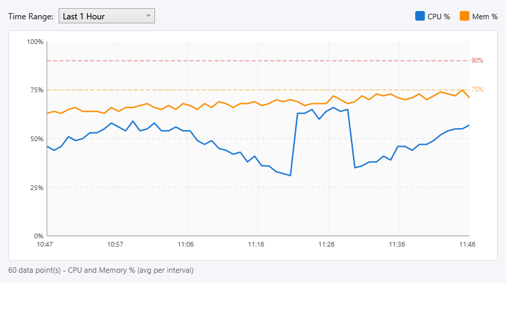
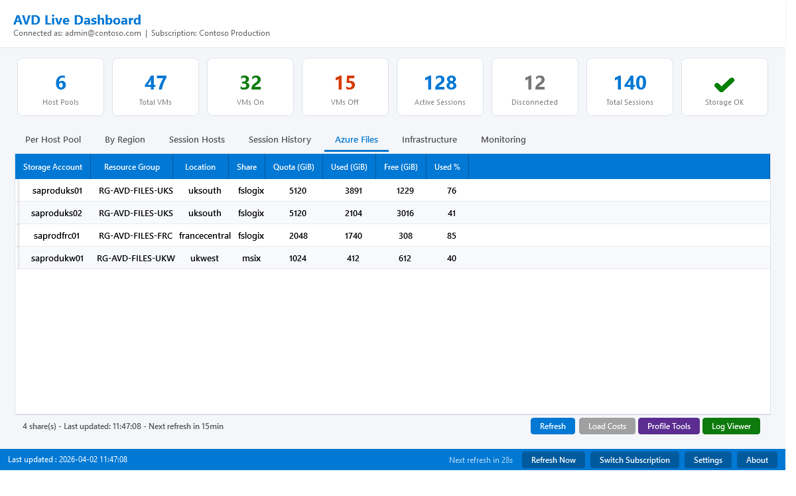
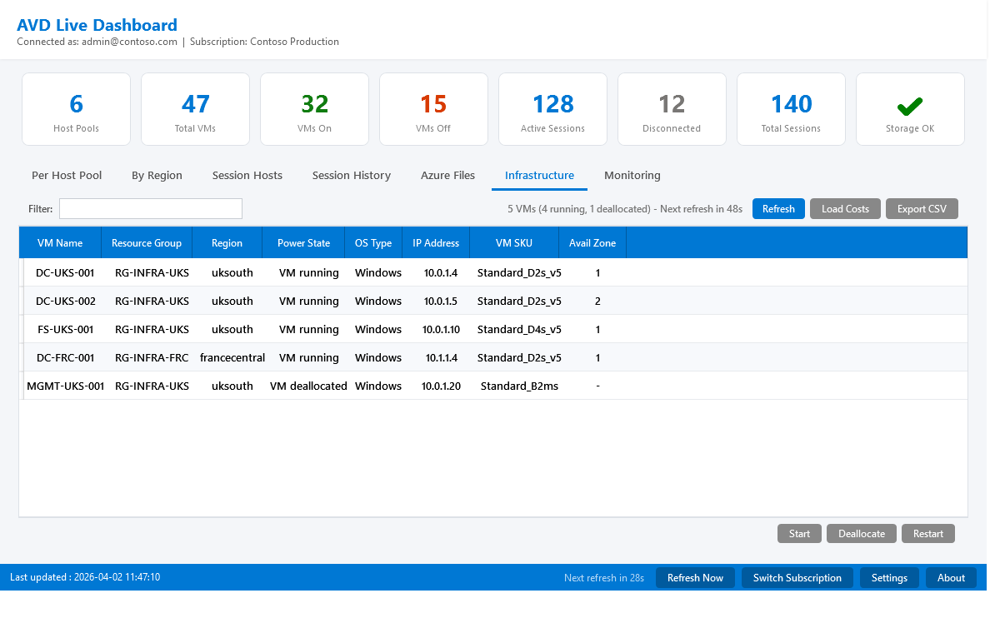
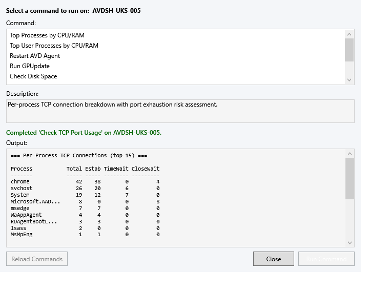
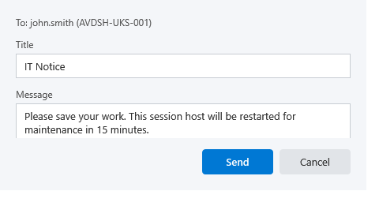
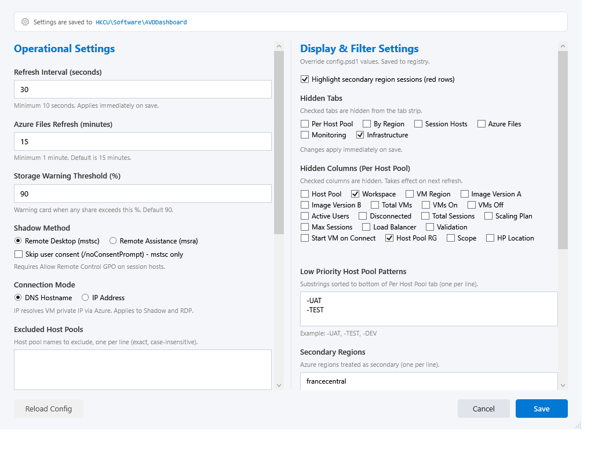
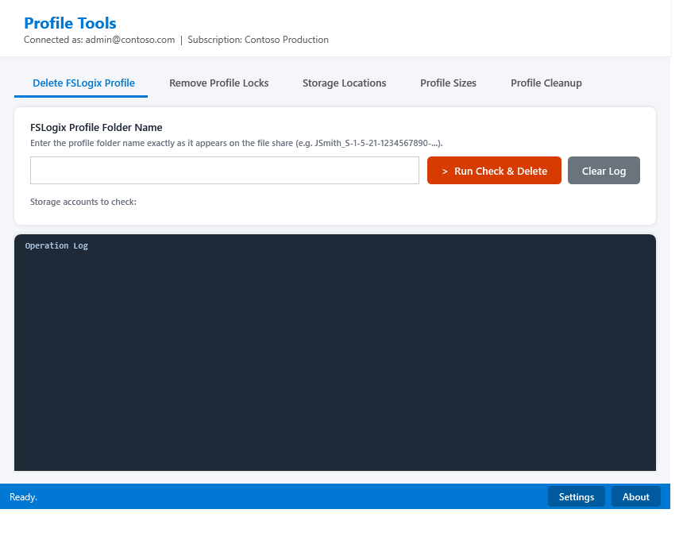

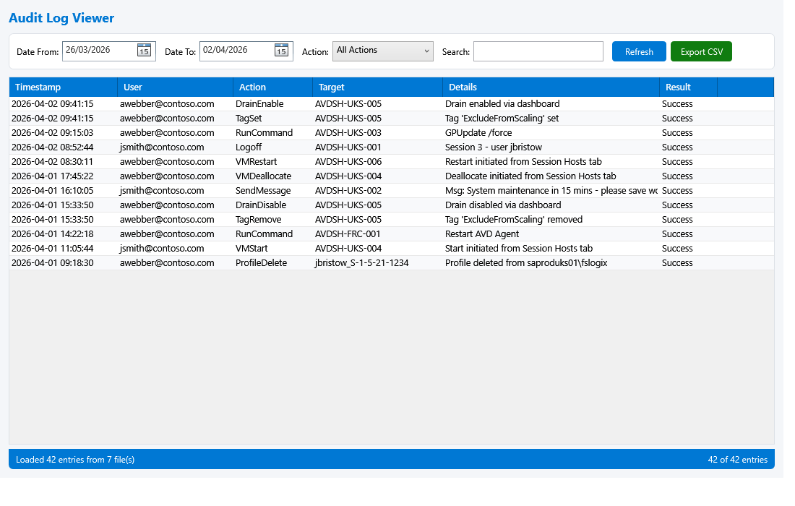

---

*GitHub: [virtualwebber](https://github.com/virtualwebber)*

*Developed with the assistance of [Claude](https://claude.ai) (Anthropic)*
